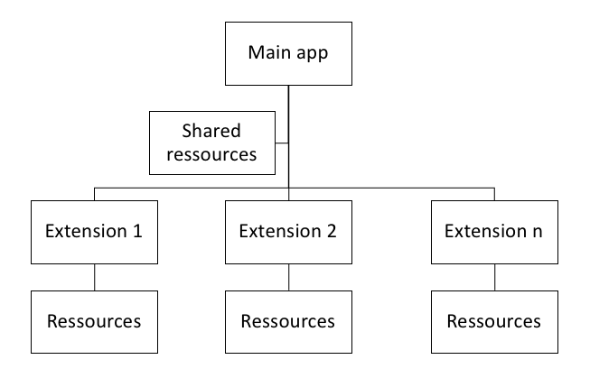

# Uniform Resource Locator

[](https://github.com/userfrosting/UniformResourceLocator/releases)
[](LICENSE.md)
[](https://travis-ci.org/userfrosting/UniformResourceLocator)
[](https://ci.appveyor.com/project/userfrosting/uniformresourcelocator)
[](https://codecov.io/gh/userfrosting/UniformResourceLocator)
[](https://chat.userfrosting.com/channel/support)
[](https://opencollective.com/userfrosting#backer)

Louis Charette 2018

The _Uniform Resource Locator_ module handles resource aggregation and stream wrapper related tasks for [UserFrosting](https://github.com/userfrosting/UserFrosting).

# Problem to Solve

It's easy to find files when they are located in a single place. It's another task when looking for files scattered across multiple directory. Step into the world of package and dependencies and the nightmare begins.



It's like trying to find someone in a one story house vs. a 25 stories office building when you don't know on which floor the person is. This package goal is to help you locate things in that office building without having to search floor by floor each time. In other words, it is a way of aggregating many search paths together.

# Documentation

* [Main Documentation](docs/)
* [API docs](docs/api.md)
* [Working example / tutorial](docs/Example.md).

## Building doc

```
vendor/bin/phpdoc-md generate src/ > docs/api.md
```

## [Style Guide](STYLE-GUIDE.md)

## [Testing](RUNNING_TESTS.md)

# References

- [The Power of Uniform Resource Location in PHP](https://web.archive.org/web/20131116092917/http://webmozarts.com/2013/06/19/the-power-of-uniform-resource-location-in-php/)
- [When we should we use stream wrapper and socket in PHP?](https://stackoverflow.com/questions/11222498/when-we-should-we-use-stream-wrapper-and-socket-in-php)
- [rockettheme/toolbox](https://github.com/rockettheme/toolbox)
